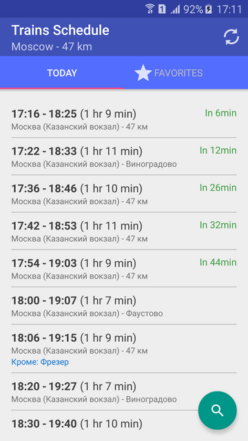

# Trains Schedule

## About 
- Show schedule of suburban electric trains using [Yandex API][yandex]
- Android application. 

## Screenshots

## Used libraries
* Robospice - library for building network async apps  
* Retrofit - library for working with REST API

## References
- https://github.com/Rexee/TrainsSchedule "Original Java Version"
- https://tech.yandex.ru/rasp/raspapi "Yandex API"
- https://github.com/stephanenicolas/robospice "Robospice"
- http://square.github.io/retrofit "Retrofit"
